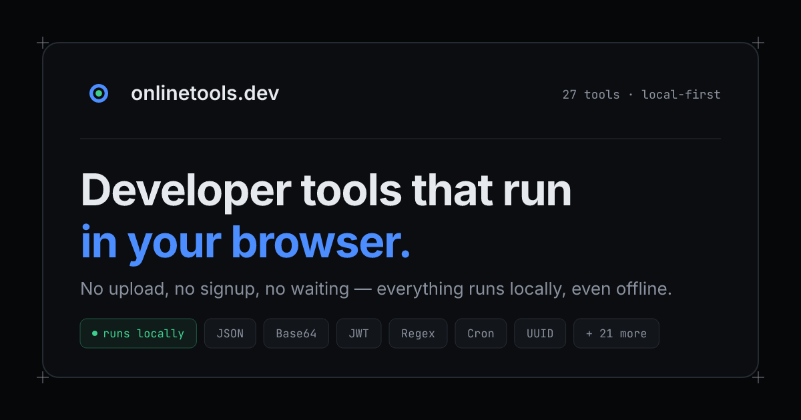

<div align="center">


# onlinetools.dev

**44 developer tools that run entirely in your browser.**
No upload, no login, no ads, no trackers — and you can verify it.

[**onlinetools.dev**](https://onlinetools.dev) · [Why this exists](https://onlinetools.dev/about) · [Changelog](https://onlinetools.dev/changelog) · [Contributing](CONTRIBUTING.md)

[](LICENSE)
[](https://github.com/noobnooc/onlinetools.dev/actions/workflows/ci.yml)
[](.nvmrc)
[](CONTRIBUTING.md)



</div>

---

## What this is

Most "online tools" sites are a thin form around a server endpoint: you paste a
JWT, a config file or a customer record, and it goes to someone else's machine.
This one doesn't have that machine. Every tool here is a pure function compiled
into the page — the site is a set of prerendered static files, and after the
page loads it makes **zero network requests**.

That single constraint shapes everything else:

| | |
| --- | --- |
| 🔒 **Local by construction** | Tools are client-side pure functions. There is no backend to log your input, because there is no backend. The [About page](https://onlinetools.dev/about) counts your browser's own network requests live so you can watch the number stay at zero. |
| ⌨️ **Keyboard-first** | `⌘K` / `Ctrl+K` opens a fuzzy palette over every tool, alias and verb. No dialogs stand between you and the first result. |
| 📋 **Smart Paste** | Paste anything anywhere and a confidence-scored detector registry classifies it — JSON, JWT, Base64, XML, CSV, a hex dump, an image data URL — and offers the right tool. |
| 🔗 **Shareable without a server** | Tool state serializes into the URL **fragment** (`#s=…`), which browsers never send upstream. A share link reproduces state with nobody in the middle. |
| ⛓️ **Pipelines** | Chain tools into a recipe (`/chain`): decode a JWT → pretty-print the payload → extract a claim, all in one pass. |
| 📴 **Offline** | An installable PWA; a service worker keeps every tool you've opened working with no connection. |
| 🌍 **18 languages** | English at the root, every other locale under its own prefix, with hand-written (not machine-templated) long-form content per tool. |

## Tools

<details open>
<summary><b>JSON &amp; Data</b> (7)</summary>

| Tool | What it does |
| --- | --- |
| [JSON Formatter & Validator](https://onlinetools.dev/t/json-formatter) | Format, validate and minify JSON with precise error positions |
| [JSON ↔ YAML ↔ TOML Converter](https://onlinetools.dev/t/json-to-yaml) | Convert between JSON, YAML and TOML with format auto-detection |
| [JSON ↔ CSV Converter](https://onlinetools.dev/t/json-to-csv) | Flatten JSON to CSV, or parse CSV back into typed JSON objects |
| [JSON → TypeScript Types](https://onlinetools.dev/t/json-to-typescript) | Infer TypeScript interfaces from a JSON sample instantly |
| [JSONPath Tester](https://onlinetools.dev/t/jsonpath-tester) | Query JSON with JSONPath expressions and see every match with its path |
| [XML ↔ JSON Converter](https://onlinetools.dev/t/xml-to-json) | Convert XML documents to JSON and back, attributes included |
| [JSON Schema Validator & Generator](https://onlinetools.dev/t/json-schema-validator) | Validate JSON against a schema, or infer a schema from sample data |

</details>

<details>
<summary><b>Encoding</b> (8)</summary>

| Tool | What it does |
| --- | --- |
| [Base64 Encode / Decode](https://onlinetools.dev/t/base64-decode) | Encode text to Base64 or decode Base64 to text, URL-safe included |
| [JWT Decoder](https://onlinetools.dev/t/jwt-decoder) | Decode JWT header and payload, check expiry — fully offline |
| [URL Encode / Decode](https://onlinetools.dev/t/url-encode-decode) | Percent-encode or decode URL components and query strings |
| [HTML Entities Encode / Decode](https://onlinetools.dev/t/html-entities) | Escape text for HTML or decode `&`-style entities back to characters |
| [Unicode Character Inspector](https://onlinetools.dev/t/unicode-inspector) | See code points, UTF-8/UTF-16 bytes and escapes for every character |
| [String Escaper / Unescaper](https://onlinetools.dev/t/string-escape) | Escape or unescape strings for JSON, JavaScript, Java, XML, SQL and CSV |
| [Number Base Converter](https://onlinetools.dev/t/number-base-converter) | Convert numbers between binary, octal, decimal, hex and any base up to 36 |
| [Text ↔ Hex / Binary Converter](https://onlinetools.dev/t/text-to-hex) | Turn text into hex, binary or decimal bytes and decode byte dumps back |

</details>

<details>
<summary><b>Code &amp; Markup</b> (6)</summary>

| Tool | What it does |
| --- | --- |
| [SQL Formatter](https://onlinetools.dev/t/sql-formatter) | Format SQL with dialect-aware keywords, or minify it to one line |
| [XML Formatter & Validator](https://onlinetools.dev/t/xml-formatter) | Pretty-print, minify and validate XML with exact error positions |
| [Markdown ↔ HTML Converter](https://onlinetools.dev/t/markdown-to-html) | Render Markdown to HTML with live preview, or turn HTML back into Markdown |
| [HTML Formatter & Minifier](https://onlinetools.dev/t/html-formatter) | Beautify messy HTML or minify it for production |
| [CSS Formatter & Minifier](https://onlinetools.dev/t/css-formatter) | Beautify CSS for reading or minify it for shipping |
| [JavaScript Formatter & Minifier](https://onlinetools.dev/t/js-formatter) | Beautify JavaScript or minify it with real compression and mangling |

</details>

<details>
<summary><b>Text</b> (6)</summary>

| Tool | What it does |
| --- | --- |
| [Text Diff Checker](https://onlinetools.dev/t/diff-checker) | Compare two texts line by line and see additions and deletions |
| [Case Converter](https://onlinetools.dev/t/case-converter) | Switch between camelCase, snake_case, kebab-case, PascalCase and more |
| [Word Counter](https://onlinetools.dev/t/word-counter) | Count words, characters, sentences, bytes and reading time as you type |
| [Lorem Ipsum Generator](https://onlinetools.dev/t/lorem-ipsum-generator) | Generate placeholder words, sentences or paragraphs for mockups |
| [Slug Generator](https://onlinetools.dev/t/slug-generator) | Turn titles into clean URL slugs with separator and length options |
| [Sort & Dedupe Lines](https://onlinetools.dev/t/sort-lines) | Sort lines alphabetically or naturally, remove duplicates and empties |

</details>

<details>
<summary><b>Image</b> (5)</summary>

| Tool | What it does |
| --- | --- |
| [Image ↔ Base64 Converter](https://onlinetools.dev/t/image-to-base64) | Turn images into Base64 data URLs and back — with CSS and HTML snippets |
| [Image Format Converter](https://onlinetools.dev/t/image-converter) | Convert images between PNG, JPEG and WebP with a quality dial |
| [Image Resizer](https://onlinetools.dev/t/image-resizer) | Resize images by width, height or percentage — sharp and entirely offline |
| [Favicon Generator](https://onlinetools.dev/t/favicon-generator) | Turn any image into `favicon.ico` plus the full PNG and manifest icon set |
| [QR Code Decoder](https://onlinetools.dev/t/qr-code-decoder) | Read QR codes from images or live camera — URLs, WiFi and text, offline |

</details>

<details>
<summary><b>Web</b> (4)</summary>

| Tool | What it does |
| --- | --- |
| [Regex Tester](https://onlinetools.dev/t/regex-tester) | Test regular expressions with live match highlighting and groups |
| [URL Parser](https://onlinetools.dev/t/url-parser) | Break a URL into protocol, host, path and query parameters |
| [Color Converter](https://onlinetools.dev/t/color-converter) | Convert colors between HEX, RGB, HSL and OKLCH with live preview |
| [User-Agent Parser](https://onlinetools.dev/t/user-agent-parser) | Identify browser, engine, OS and device from a User-Agent string |

</details>

<details>
<summary><b>Generators</b> (3) · <b>Hashing &amp; Crypto</b> (2) · <b>Date &amp; Time</b> (2) · <b>Privacy</b> (1)</summary>

| Tool | What it does |
| --- | --- |
| [UUID Generator](https://onlinetools.dev/t/uuid-generator) | Generate UUID v4/v7, ULID and Nano ID — single or in bulk |
| [Password Generator](https://onlinetools.dev/t/password-generator) | Random passwords with charset options and an honest entropy meter |
| [QR Code Generator](https://onlinetools.dev/t/qr-code-generator) | Generate crisp QR codes as SVG or PNG — no watermark, no upload |
| [Hash Generator](https://onlinetools.dev/t/hash-generator) | MD5, SHA-1, SHA-256, SHA-512 and HMAC — computed in your browser |
| [Bcrypt Hash & Verify](https://onlinetools.dev/t/bcrypt-generator) | Hash passwords with bcrypt and check hashes against plaintext |
| [Unix Timestamp Converter](https://onlinetools.dev/t/timestamp-converter) | Convert unix timestamps to human dates and back, with relative time |
| [Cron Expression Parser](https://onlinetools.dev/t/cron-parser) | Explain any cron schedule in plain English with the next run times |
| [EXIF Viewer & Remover](https://onlinetools.dev/t/exif-viewer) | See what metadata your photos carry — and strip it without re-encoding |

</details>

## Quick start

Requires **Node ≥ 26** (see [`.nvmrc`](.nvmrc)) and **pnpm** — the version is
pinned by `packageManager`, so `corepack enable` gets you the right one.

```sh
git clone https://github.com/noobnooc/onlinetools.dev.git
cd onlinetools.dev
corepack enable          # once, if you don't already have pnpm 10.x
pnpm install
pnpm dev                 # → http://localhost:5173
```

No `.env` file, no API keys, no services to start. There is nothing to
configure because there is no backend.

| Script | What it does |
| --- | --- |
| `pnpm dev` | Vite dev server with HMR |
| `pnpm test` | Vitest unit tests — 37 suites: one per tool module, plus detection, ranking, pipelines and URL state |
| `pnpm test:watch` | The same, in watch mode |
| `pnpm check` | `svelte-check` in TypeScript strict mode |
| `pnpm build` | Static build via `@sveltejs/adapter-cloudflare` |
| `pnpm preview` | Serve the production build locally |
| `pnpm brand:assets` | Regenerate favicons, PWA icons and the OG image |
| `pnpm deploy` | Build and `wrangler deploy` (maintainers only) |

`pnpm test` and `pnpm check` are what CI runs — get both green before opening a PR.

## Project layout

```
src/
  lib/
    tools/          pure logic, every module paired with its own test file
      registry.ts   tool metadata: slugs, categories, aliases, related, accepts
      content.ts    hand-written About/FAQ copy per tool (+ content.<locale>.ts)
    components/     UI shell — InputArea, OutputPanel, palette, sidebar…
      tools/        one Svelte component per tool, lazily imported
    detect/         Smart Paste detectors + the data-format taxonomy
    chain/          pipeline engine, 26 ops and 5 curated preset recipes
    i18n/           locale codes, message catalogs, t()/lp()/canonical helpers
    state/          URL-fragment state, hash restore, favorites, UI stores
  routes/
    [[lang=lang]]/  every page behind an optional locale prefix
      t/[slug]/     tool pages — prerendered per tool × locale
      chain/        pipeline workbench + preset pages
    sitemap.xml/    generated from the registry × locales
static/             icons, manifest, service worker, security.txt
scripts/            brand asset generator
```

Deeper dives live in [`docs/`](docs/):
[architecture](docs/architecture.md) ·
[adding a tool](docs/adding-a-tool.md) ·
[translations](docs/i18n.md) ·
[deployment](docs/deployment.md) ·
[brand](BRAND.md)

## Design contracts

These are the invariants that keep the project honest. A change that breaks one
of them needs a very good reason:

1. **No network calls at runtime.** No analytics, no fonts from a CDN, no
   "just this one" API. A tool that cannot work offline does not ship.
2. **Logic is pure functions.** Every tool module exports functions returning
   `{ ok: true, value } | { ok: false, error, line?, column? }` and holds no DOM
   references. UI components never contain conversion logic.
3. **Every tool module has unit tests.** Round-trips, malformed input, Unicode.
4. **State lives in the URL fragment**, never in a query string or on a server.
   Oversized input refuses to produce a share link rather than emitting a
   megabyte URL.
5. **Errors are inline**, with line and column where the format allows. No
   dialogs, no toasts.
6. **One accent color.** Status colors mean status; borders express hierarchy,
   not shadows. See [BRAND.md](BRAND.md).

## Security & privacy posture

- Pages are served with a strict Content-Security-Policy (`default-src 'self'`,
  `form-action 'none'`, no third-party origins) generated in hash mode, plus
  frame/referrer hardening in [`_headers`](_headers).
- Share links carry attacker-controllable content, so anything rendered from
  one — the Markdown preview in particular — is sanitized aggressively.
- Every production dependency is permissively licensed and audited to make sure
  none of it phones home.

Found a hole? See [SECURITY.md](SECURITY.md).

## Contributing

Contributions are very welcome — a new tool, a fix, a translation, or a better
sentence in the FAQ that stops someone from googling twice.

- [CONTRIBUTING.md](CONTRIBUTING.md) — setup, conventions, PR checklist
- [docs/adding-a-tool.md](docs/adding-a-tool.md) — the eight files a new tool touches
- [docs/i18n.md](docs/i18n.md) — adding or improving a translation
- [CODE_OF_CONDUCT.md](CODE_OF_CONDUCT.md) — be decent

Good first issues are labeled [`good first issue`](https://github.com/noobnooc/onlinetools.dev/labels/good%20first%20issue).

## Roadmap

Direction, not promises — the [changelog](https://onlinetools.dev/changelog) is
the record of what actually shipped.

- **Now** — deepening the pipeline workbench, batch mode (run a tool over many
  inputs at once), and per-tool dynamic OG images.
- **Next** — local history in IndexedDB (opt-in, never synced), more preset
  recipes, wider Smart Paste coverage.
- **Someday** — AI actions *inside* individual tools (explain this regex,
  generate this cron), always with a non-AI fallback and never a chat window.
  If this ever needs a server round-trip it will be opt-in, clearly labeled,
  and off by default.

## Stack

[SvelteKit](https://kit.svelte.dev) + [Svelte 5 runes](https://svelte.dev/docs/svelte/what-are-runes) ·
TypeScript strict ·
[Tailwind CSS 4](https://tailwindcss.com) over CSS-variable design tokens ·
[Bits UI](https://bits-ui.com) headless primitives ·
[lucide](https://lucide.dev) icons ·
[Vitest](https://vitest.dev) ·
[Cloudflare Workers Static Assets](https://developers.cloudflare.com/workers/static-assets/) via `@sveltejs/adapter-cloudflare`

## License

[MIT](LICENSE) © [Nooc](https://nooc.me)

The tools are built on the work of others — `marked`, `dompurify`, `yaml`,
`smol-toml`, `fast-xml-parser`, `sql-formatter`, `js-beautify`, `terser`,
`ajv`, `bcryptjs`, `jsqr`, `qrcode-generator` and `ua-parser-js` — each under
its own permissive license. Thank you.
